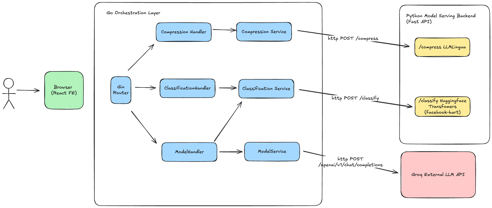
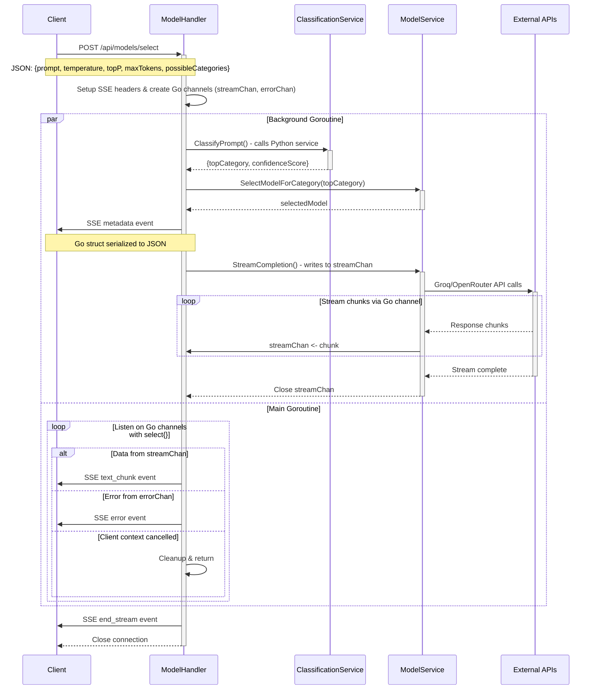

# TokenFlow

A hybrid Go + Python backend system for intelligent prompt compression and LLM generation, designed to demonstrate modern microservice architecture patterns and efficient ML model serving.

## Architecture Overview

TokenFlow uses a **multilanguage microservice architecture** that leverages the strengths of both Go and Python:

- **Go Backend**: High-performance HTTP server acting as the main API gateway and orchestrator
- **Python Backend**: Specialized ML model server for prompt compression and classification
- **External LLM APIs**: Integration with Groq for powerful text generation

## System Architecture



## Key Design Patterns

### Service Separation
- **ClassificationService**: Dedicated to prompt classification using Python's Hugging Face Transformers
- **CompressionService**: Handles text compression via Python's LLMLingua library  
- **ModelService**: Manages direct LLM generation and model selection logic

### Constructor Pattern (Idiomatic Go)
Each service follows Go's standard constructor pattern:
```go
type ModelService struct { /* fields */ }           // Struct definition
func NewModelService() *ModelService { /* init */ }  // Constructor function
```

### Dependency Injection
Services are initialized once and injected into handlers:
```go
modelService := services.NewModelService()
classificationService := services.NewClassificationService()
modelHandler := handlers.NewModelHandler(modelService, classificationService)
```

## Technology Stack

### Go Backend
- **Framework**: Gin (high-performance HTTP router)
- **HTTP Client**: Standard `net/http` for Python service calls
- **Streaming**: Server-Sent Events (SSE) for real-time LLM output
- **Configuration**: Environment variables with `godotenv`

### Python Backend  
- **Framework**: FastAPI (async Python web framework)
- **Package Management**: uv (fast Python package installer and resolver)
- **Environment Management**: Hermit (reproducible development environments)
- **ML Libraries**: 
  - LLMLingua (prompt compression)
  - Hugging Face Transformers (classification)
- **Models**: 
  - BART-MNLI for zero-shot classification
  - BERT multilingual for compression

### External APIs
- **Groq**: High-performance LLM inference
- **OpenRouter**: Alternative LLM provider (configured but not actively used)

## Data Flow Examples

### Compression Flow
1. Frontend → `POST /api/compress` → Go CompressionHandler
2. Go CompressionService → `POST http://localhost:8001/compress` → Python FastAPI
3. Python LLMLingua processing → JSON response → Go
4. Go → Frontend (compressed text + metrics)

### Classification Flow  
1. Frontend → `POST /api/classify` → Go ClassificationHandler
2. Go ClassificationService → `POST http://localhost:8001/classify` → Python FastAPI
3. Python Transformers pipeline → JSON response → Go
4. Go → Frontend (categories + confidence scores)

### Generation Flow
1. Frontend → `POST /api/generate` → Go ModelHandler
2. Go ModelService → Groq API (streaming)
3. Groq → Go (token-by-token via SSE) → Frontend

## Project Structure

```
tokenflow/
├── frontend/                 # React/Next.js UI
├── backend_go/              # Go API Gateway
│   ├── cmd/server/          # Application entry point
│   ├── pkg/
│   │   ├── handlers/        # HTTP request handlers
│   │   ├── services/        # Business logic services
│   │   ├── models/          # Data structures
│   │   └── config/          # Configuration management
│   └── go.mod
├── backend_python/          # Python ML Server
│   └── src/tokenflow_python/
│       └── main.py          # FastAPI application
└── README.md               # This file
```

## Getting Started

### Prerequisites
- **Go 1.24+**
- **Python 3.9+** (managed via Hermit)
- **uv** (Python package manager - installed via Hermit)
- **Hermit** (for reproducible development environment)
- Environment variables configured in `.env`

### Environment Setup
1. **Install Hermit** (if not already installed):
   ```bash
   curl -fsSL https://github.com/cashapp/hermit/releases/latest/download/install.sh | bash
   ```

2. **Activate Hermit environment** (from project root):
   ```bash
   . bin/activate-hermit
   ```
   This automatically installs the correct Python version and uv.

> **Why Hermit + uv?**
> - **Hermit** ensures reproducible development environments across machines
> - **uv** provides fast Python package installation and dependency resolution
> - Together they eliminate "works on my machine" issues and speed up development

### Run the System
1. **Python Backend** (Terminal 1):
   ```bash
   cd backend_python
   uv run --active python -m src.tokenflow_python.main
   # Runs on http://localhost:8001
   ```

2. **Go Backend** (Terminal 2):
   ```bash
   cd backend_go
   go run cmd/server/main.go
   # Runs on http://localhost:8000
   ```

3. **Frontend** (Terminal 3):
   ```bash
   cd frontend
   npm run dev
   # Runs on http://localhost:3000
   ```

## API Documentation

### Core Endpoints
- `POST /api/compress` - Compress text using LLMLingua (ratio-based)
- `POST /api/classify` - Classify prompts into categories
- `POST /api/generate` - Stream LLM generation from specified model
- `POST /api/models/select` - Auto-select and stream from best model
- `GET /api/model-rankings` - Available model information

### Request/Response Examples

**Compression Request:**
```json
{
  "text": "Long text to be compressed...",
  "ratio": 0.5
}
```

**Classification Request:**
```json
{
  "prompt": "Write a function to calculate fibonacci",
  "possible_categories": ["reasoning", "function-calling", "text-to-text"],
  "multi_label": false
}
```

## Request Lifecycle: `/api/models/select`

The following diagram illustrates the request lifecycle for the `/api/models/select` endpoint, which automatically selects the best model based on prompt classification and streams the LLM response:



### Step-by-Step Request Flow

1. **Client Request**: Client sends `POST /api/models/select` with JSON payload containing prompt, temperature, topP, maxTokens, and possibleCategories

2. **Handler Setup**: ModelHandler validates the request and sets up Server-Sent Events (SSE) headers for streaming response

3. **Go Channel Creation**: ModelHandler creates two Go channels:
   - `streamChan` - for streaming LLM response chunks
   - `errorChan` - for error handling

4. **Concurrent Processing**: Two goroutines run in parallel:

   **Background Goroutine (ML Processing):**
   - **Classification**: Calls ClassificationService which makes HTTP request to Python backend
   - **Model Selection**: Based on classification result, selects appropriate LLM model
   - **Metadata Event**: Sends SSE event with selected model and classification info
   - **Stream Setup**: Calls ModelService.StreamCompletion() which writes to `streamChan`
   - **LLM API Calls**: Makes streaming requests to Groq/OpenRouter APIs
   - **Channel Operations**: Each response chunk is sent via `streamChan <- chunk`
   - **Cleanup**: Closes `streamChan` when stream completes

   **Main Goroutine (SSE Management):**
   - **Channel Listening**: Uses Go's `select{}` statement to listen on multiple channels
   - **Stream Forwarding**: Forwards data from `streamChan` as SSE text_chunk events
   - **Error Handling**: Forwards errors from `errorChan` as SSE error events  
   - **Context Cancellation**: Handles client disconnection and cleanup

5. **Stream Completion**: Sends final SSE end_stream event and closes connection

### Key Components:

1. **Concurrent Architecture**: Main HTTP goroutine handles SSE streaming while background goroutine processes ML tasks
2. **Service Integration**: Classification service calls Python backend, model service integrates with Groq API
3. **Real-time Streaming**: Server-Sent Events provide immediate feedback to client
4. **Error Handling**: Errors are streamed as events, allowing graceful frontend handling
5. **Resource Management**: Proper channel cleanup and context cancellation

## Architecture Benefits

1. **Performance**: Go handles concurrent HTTP requests efficiently
2. **Specialization**: Python excels at ML model serving 
3. **Modularity**: Services can be developed, deployed, and scaled independently
4. **Type Safety**: Go's strong typing catches errors at compile time
5. **Maintainability**: Clear separation of concerns between services
6. **Scalability**: Each service can be horizontally scaled based on demand

## Future Improvements

- [ ] Service discovery for dynamic Python service URLs
- [ ] Health checks and circuit breakers
- [ ] Metrics and observability (Prometheus/Grafana)
- [ ] Testing and CI/CD